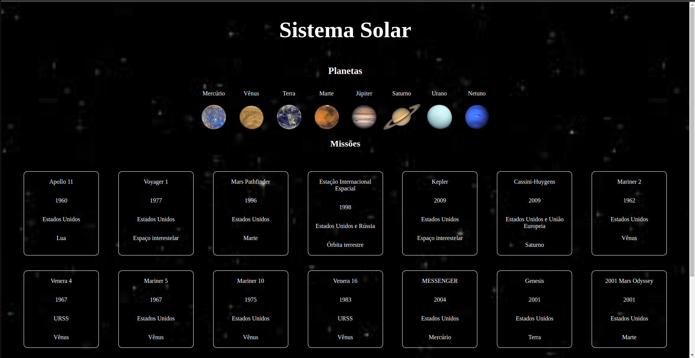

# Solar System Project!

## Description

In this project, a model of the solar system was developed. By using this application a user can:

  * View all the planets of the solar system rendered on the screen;
  * View all cards with information about space missions that took place throughout history;

 Project developed during the Trybe software development course.

## Tools

  * React;
  * Javascript ES6;
  * HTML5;
  * CSS3.

## Skills Developed

  * Using JSX in React
  * Correct use of `render()`, `import`, `props` and `PropTypes` methods to render your components
  * Creating class components in React
  * Creating multiple components from an array